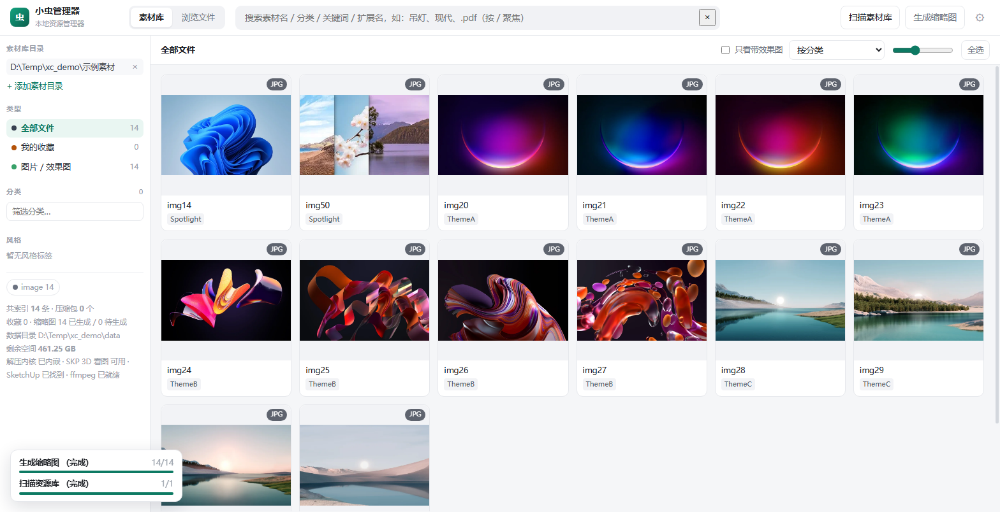
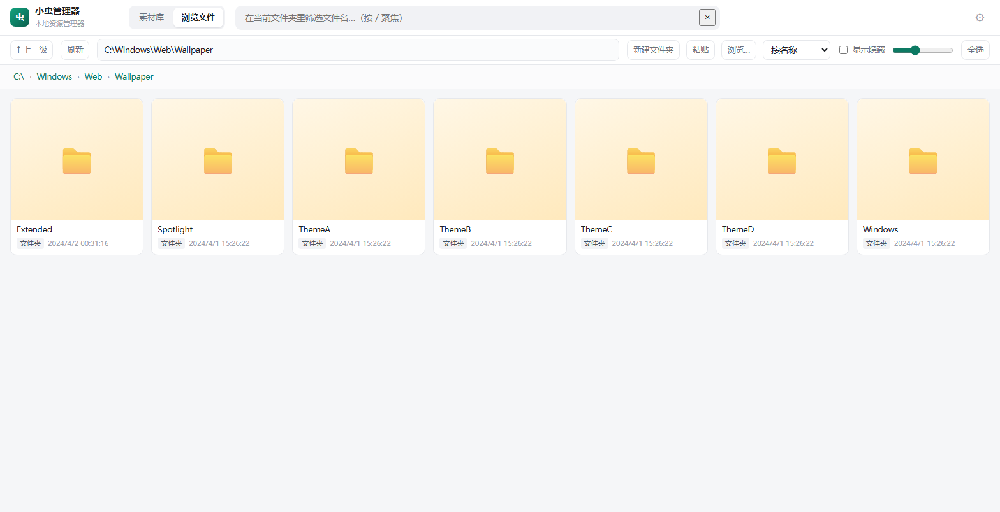
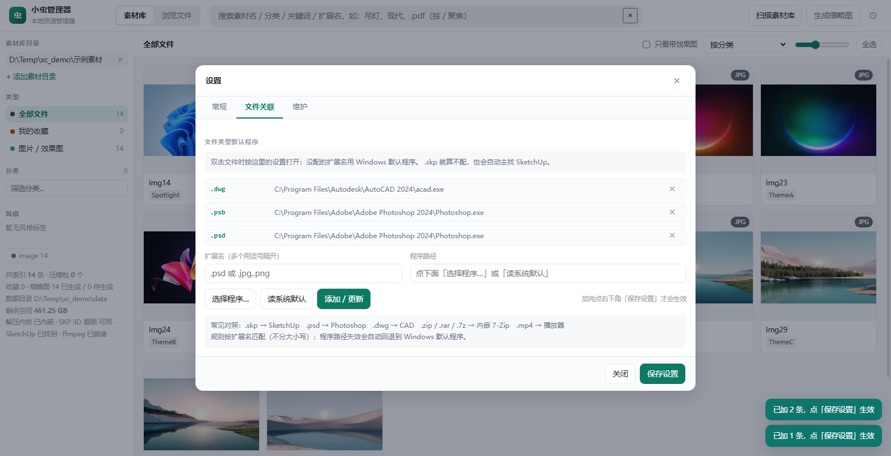

# 小虫管理器 · XiaoChong Manager

> 跑在你自己电脑上的**资源管理器 + 素材库**。Windows 桌面程序，界面用本地浏览器打开，
> **只监听 127.0.0.1，不联网、不上传**，文件全在你自己的硬盘上。

给家装 / 室内设计师做的：把散在硬盘各处的 SU 单体模型、贴图、效果图、CAD 图纸一次性索引起来，
按 **类型 / 分类 / 风格** 浏览，带缩略图，双击就能打开或者拖进 SketchUp。
同时它是个**通用资源管理器** —— 不挑文件类型，任何文件都能浏览、预览、搜索、打开。





---

## 目录

- [这是什么](#这是什么)
- [功能一览](#功能一览)
- [快速上手](#快速上手)
- [支持的预览能力](#支持的预览能力)
- [给每种扩展名单独指定打开程序](#给每种扩展名单独指定打开程序)
- [关于打开-skp](#关于打开-skp)
- [内嵌能力（不用另装软件）](#内嵌能力不用另装软件)
- [快捷键](#快捷键)
- [隐私与安全](#隐私与安全)
- [安装](#安装)
- [从源码打包成安装包](#从源码打包成安装包)
- [目录结构](#目录结构)
- [技术栈](#技术栈)
- [常见问题](#常见问题)
- [已知限制](#已知限制)
- [更新日志](#更新日志)
- [第三方组件与许可](#第三方组件与许可)
- [同类项目](#同类项目)

---

## 这是什么

一个**单文件、零后端依赖**的本地工具：一个 Python 进程（FastAPI）+ 一个静态前端，
数据存在 SQLite 里，缩略图缓存在本地目录。用它自己的话说是：

- **素材库模式**：只索引你指定的几个目录，按类型 / 分类 / 风格重新组织，像逛素材网站一样逛自己的硬盘
- **浏览文件模式**：就是资源管理器，整个磁盘随便逛，双击文件夹进入、双击文件打开

两个模式共用一套缩略图、搜索和打开逻辑，顶栏一键切换。

---

## 功能一览

| 能力 | 说明 |
| --- | --- |
| 浏览 | 任意盘任意目录，面包屑导航、上一级、显示/隐藏隐藏文件、按名称/时间/大小/类型排序 |
| 搜索 | 素材名、分类、关键词、`.扩展名` 一起搜，输入即过滤（`/` 快速聚焦搜索框） |
| 缩略图 | 图片、PSD、CAD、PDF、字体、文本、代码、压缩包、视频…… 20+ 种类型都有缩略图 |
| 3D 看图 | 选中 `.skp` 直接转着看（线框 / 包围盒 / 真实尺寸），**不打开 SketchUp** |
| 分类浏览 | 点左侧分类标签（吊灯 / 茶几 / 楼梯…）= 只看这一组，卡片带缩略图 |
| 压缩包 | 压缩包**内部文件也被索引**，`01.zip` 里的 `kb0001.jpg` 能直接搜到并预览；解压不依赖外部软件 |
| 批量重命名 | 选中多个按 F2：查找替换 / 加前后缀 / 编号，**先预览再执行**，执行后还能一键撤销 |
| 复制粘贴 | `Ctrl+C / Ctrl+X / Ctrl+V`，跨文件夹、跨盘；压缩包里的文件会先自动解出来 |
| 复制到… | 选中后点「**复制到…**」/「**移动到…**」，直接挑一个目标文件夹，一步到位不用来回切模式 |
| 打开 | 双击用合适的程序打开；**每种扩展名都能单独指定程序**，没配的走系统默认；打开后写明用了哪个程序，并把窗口提到最前 |
| 看图软件 | 图片「打开」用哪个软件可以**自己指定**（含 Windows 自带照片查看器），修掉「双击图片点了没反应」 |
| 缓存提醒 | **定时提醒 + 自己挑着清**：超过设定体积就在底部弹提醒；清理面板按分类 / 类型 / 新旧分组，**勾哪项清哪项**，没勾的一点不动；开关 / 间隔 / 上限 / 只提醒一次都能调 |
| 收藏 | 卡片右上角的 **☆ 点一下就收藏**（变成金色 ★，再点一下取消，不会误打开文件）；左侧「**我的收藏**」一键只看收藏过的；选中多个可**按 `F` 批量收藏**；新增「按收藏时间」排序；「浏览文件」里看中的文件也能收藏，会自动补进素材库索引 |
| 其它 | 只看带效果图的模型、文件夹大小统计、新建文件夹、压缩为 zip、删除到回收站（可还原）、定位、复制完整路径 |

---

## 快速上手

1. 打开程序 → 顶栏「**+ 添加素材目录**」（或地址栏直接粘一个路径回车）
2. 点右上角「**扫描素材库**」，等进度条走完
3. 点「**生成缩略图**」把卡片刷出来（也可以不点，滚动到时自动生成）
4. 左侧点类型 / 分类 / 风格筛选，中间双击打开，右侧抽屉看详情

---

## 支持的预览能力

| 类型 | 缩略图 | 说明 |
| --- | --- | --- |
| 图片 jpg / png / webp / bmp / gif / avif / heic… | ✅ | 直接出图 |
| 分层图 psd / psb / tif / tga / exr / hdr | ✅ | 取内嵌预览或首图层 |
| CAD dwg / dxf | ✅ | 有外部看图器的用其预览，另外对 dxf 做文本级兜底 |
| PDF | ✅ | 用 PyMuPDF 系（pypdfium2）渲染首页 |
| 3D skp | ✅ 缩略图 + ✅ 3D 看图 | 缩略图不需要 SketchUp；3D 看图需要本机装过 SketchUp |
| 3D 其它 obj / fbx / 3ds / stl | ✅ 缩略图 | 有外部看图器则用其预览 |
| 视频 mp4 / mov / mkv… | ⚙️ 需 ffmpeg | 设置里填 ffmpeg 路径即可（可选） |
| 压缩包 zip / rar / 7z | ✅ | 显示为「压缩包」卡片，可展开看内部清单 |
| 文本 / 代码 / 表格 / 字体 | ✅ | 显示前若干行或字体样例 |

> 缩略图都不是必需的：没有缩略图也能浏览、搜索、打开。

---

## 给每种扩展名单独指定打开程序

设置 → 「**文件关联**」页签：

1. 「扩展名」里填 `.psd`（多个用逗号隔开，如 `.jpg,.png`）
2. 点「**读系统默认**」自动读注册表里当前的默认程序，或点「**选择程序…**」手动挑一个 exe
3. 点「**添加 / 更新**」→ 点右下角「**保存设置**」

- 没配的扩展名照旧用 Windows 默认程序
- 配了但程序文件已经不在，会自动回退到系统默认（列表里会标黄提示）
- 打开成功后右下角会提示实际用的是哪个程序，例如 `已打开 1 项（WPS 图片查看器）`

同一个页签下面还有「**看图软件**」（所有图片通用，建议设一个）：

- 点「**换一个看图软件…**」，程序会列出本机扫到的看图程序（Windows 自带照片查看器 / WPS 图片查看器 / Photoshop……），点「用这个」即可
- 也可以点「**自己选一个程序…**」手动挑 exe，或点「**跟 Windows 默认一致**」保持系统行为
- 图片预览抽屉里也有「**指定看图软件…**」，就地就能设
- 设好之后，图片的「用看图软件打开」一定用指定的那个程序，不会再出现点了没反应



---

## 打开文件时的顺序

双击（或点「打开」）时按这个顺序挑程序，所以「每种格式都能打开」不依赖系统关联是否被人抢走：

1. 你在「设置 → 文件关联」里为该扩展名单独指定的程序
2. 图片：你指定的**看图软件**
3. `.skp`：自动找本机的 SketchUp
4. 注册表里登记的**完整打开命令**（连 `/photo /view` 这类参数一起用，比直接丢给系统可靠）
5. 交给 Windows 默认程序（商店应用走这条路）

程序启动后，小虫会把新出现的窗口**提到最前**——很多看图 / 文档软件是共享单实例，
不这样做就会「点了像是没反应」。右下角的提示会写明实际用的程序名。

---

## 关于打开 .skp

`.skp` 走一套单独的解析，**不看系统关联**（系统关联经常被别的软件抢走，或者注册表坏了）：

1. 设置里手动指定的 `SketchUp.exe` 路径
2. SketchUp 3D 看图用到的那个安装目录（自动识别，含注册表 `HKLM\SOFTWARE\SketchUp\SketchUp 20xx\InstallLocation`）
3. `C:\Program Files\SketchUp\<版本>\SketchUp\SketchUp.exe` 等常见位置

找不到时不会抛异常，而是给中文说明，并提示可以先用内置 3D 看图。

---

## 内嵌能力（不用另装软件）

- **解压**：zip / tar 系列走 Python 标准库；**rar / 7z / iso 用随程序一起装的 7-Zip**（`app/bin/7z.exe`），
  所以客户电脑上不需要装 WinRAR / 7-Zip
- **SKP 3D 看图**：走 SketchUp 官方 C API（`SketchUpAPI.dll`）导出网格，再用内置 three.js 渲染。
  SketchUp 的 SDK 受其许可证约束、**不能随本项目分发**，因此程序是「自动识别本机已装的 SketchUp + 支持自备 SDK」
  （把官方 SDK 的 `SketchUpAPI.dll` 放进 `app/bin/sketchup/` 也能用）
- **视频缩略图**：可选，依赖 ffmpeg，设置里填路径即可

---

## 快捷键

| 键 | 作用 |
| --- | --- |
| `/` | 聚焦搜索框 |
| `Ctrl+A` | 全选 |
| `Ctrl+C` / `Ctrl+X` / `Ctrl+V` | 复制 / 剪切 / 粘贴（程序内部） |
| `Delete` | 删除到回收站（可还原） |
| `F2` | 批量重命名 |
| `F` | 收藏 / 取消收藏选中的文件 |
| `Backspace` | 上一级目录 |
| `Esc` | 取消选择 / 关闭抽屉或弹窗 |

---

## 隐私与安全

这个项目在设计上就不接触网络，可以放心放在客户机器上。

- **只监听 `127.0.0.1`**：不监听 0.0.0.0，同局域网别的机器也访问不到
- **不联网、不上传、无遥测**：没有账号体系，没有登录，没有任何统计上报；
  前端只从本地 `/static` 加载资源，three.js 也是本地内置的，**没有一处 CDN 外链**
- **源码里没有密码 / 密钥 / 令牌**（自查过：无 `password` / `api_key` / `token` / 私钥 / 邮箱 / 手机号）
- **数据都在本地**：索引（`data/index.db`）、缩略图（`data/thumbs`）、设置（`data/config.json`）
  全在你的数据目录里，随时可以在设置里清理
- **删除走回收站**：用的 Windows 回收站 API（`Microsoft.VisualBasic.FileIO`），不是直接抹掉
- **`.gitignore` 已经把 `data/` 排除**：`index.db` 里有你整块硬盘的文件清单，
  `thumbs/` 是你的缩略图 —— 这些**永远不要提交到仓库**

> 唯一需要留意的是：程序会调用 `taskkill` 结束自己的进程（退出按钮 / 卸载脚本用），以及读取注册表查文件关联。
> 除此之外它只做普通文件操作。

---

## 安装

### 方式一：装安装包（推荐）

从 Releases 下载 `小虫管理器-x.y.z-安装包.exe`，双击安装。
默认装到 `D:\小虫管理器`（没有 D 盘就装到 Program Files），会在开始菜单和桌面建快捷方式。

- 卸载时 `data` 目录会保留，重装后索引和缩略图继续可用
- 安装包里已经带了 7-Zip，不需要你另装

### 方式二：源码运行

```powershell
git clone https://github.com/jiyideweidao/xiaochong-manager.git
cd xiaochong-manager
python -m venv .venv
.venv\Scripts\pip install -r requirements.txt
.venv\Scripts\python app\start.py
```

或者双击 `启动小虫管理器.bat`。启动后浏览器会自动打开 <http://127.0.0.1:8765/>。

- 端口：环境变量 `XC_PORT`（默认 8765）
- 数据目录：环境变量 `XC_DATA`（默认 `<程序目录>\data`，不可写时退到 `%LOCALAPPDATA%`）
- 停止：双击 `停止小虫管理器.bat`，或设置 → 「维护」→ 退出程序

---

## 从源码打包成安装包

```powershell
.venv\Scripts\pip install pyinstaller
.venv\Scripts\python tools\build_installer.py
```

一条命令做四件事：生成安装附加文件（说明 / 启动停止 bat / 默认配置）→ PyInstaller 打包 →
生成 Inno Setup 脚本 → 编译安装包。产物：

- 程序目录：`tools/dist/小虫管理器/`
- 安装包：`tools/安装包/小虫管理器-x.y.z-安装包.exe`

依赖 Inno Setup 6（`winget install JRSoftware.InnoSetup`；装了才能编译出安装包，不打安装包可以跳过）。

冒烟自检（对着已安装版本或源码跑，会真的开一次记事本、做一次 3D 看图、截一圈图）：

```powershell
python tools\smoke_test.py                       # 默认 http://127.0.0.1:8765
XC_SAMPLE="D:\我的素材" python tools\smoke_test.py  # 指定要抽查的素材目录
```

清理缓存的专项自检（在临时目录里造假数据跑，不需要你的素材，也不联网）：

```powershell
python tools\cache_clean_test.py
```

收藏功能的专项自检（临时目录 + 临时端口，不动你的素材，跑完自动删）：

```powershell
python tools\favorite_test.py
```

## 目录结构

```
xiaochong-manager/
├─ app/
│  ├─ server.py              FastAPI 本地服务：所有 /api/* 都在这儿（唯一入口）
│  ├─ start.py               启动器：拉起后台服务 + 打开浏览器
│  ├─ make_icon.py           用 Pillow 生成 小虫.ico
│  ├─ 小虫.ico               程序图标
│  ├─ bin/                   内嵌 7-Zip（7z.exe / 7z.dll / 许可证）
│  ├─ static/                index.html / app.js / style.css
│  │  └─ vendor/             本地内置 three.js（r147）+ OrbitControls
│  └─ sulib/
│     ├─ config.py           路径、扩展名类型表、设置读写
│     ├─ db.py               SQLite（WAL）
│     ├─ scanner.py          扫描索引（含压缩包内部清单）
│     ├─ thumbs.py           缩略图生成（20+ 种类型分派）
│     ├─ archives.py         解压内核：zip/tar 走标准库，rar/7z 走内嵌 7-Zip
│     ├─ skp3d.py            SKP 3D 看图：SketchUp C API → XCM3 网格
│     ├─ fsops.py            磁盘操作：列表 / 复制 / 重命名 / 回收站 / 压缩 / 打开任意文件
│     ├─ ops.py              任务队列、预览暂存、重命名历史
│     └─ textutil.py         分类 / 风格推断、广告文案过滤
├─ docs/
│  ├─ 设计笔记.md             实现细节与踩坑记录（开发向）
│  └─ img/                   README 用的截图
├─ tools/
│  ├─ build_installer.py     一键打包（PyInstaller + Inno Setup）
│  ├─ smoke_test.py          端到端冒烟自检
│  ├─ cache_clean_test.py    选择性清理缓存的自检（临时目录 + 假数据）
│  ├─ favorite_test.py       收藏功能的自检（临时目录 + 临时端口）
│  └─ make_screenshots.py    生成 README 截图（用临时示例素材，不含个人文件）
├─ data/                     运行数据（已 gitignore，不入库）
├─ 启动小虫管理器.bat
├─ 停止小虫管理器.bat
└─ stop.ps1
```

---

## 技术栈

| 层 | 用的东西 |
| --- | --- |
| 后端 | Python 3.13 · FastAPI · Uvicorn · SQLite（WAL） |
| 前端 | 原生 JS（无框架、无构建）+ three.js（本地内置） |
| 图像 | Pillow · pypdfium2 |
| 解压 | 标准库 zipfile/tarfile + 内嵌 7-Zip |
| 3D | SketchUp C API → 自研 XCM3 二进制网格 → three.js |
| 打包 | PyInstaller（onedir） + Inno Setup |

---

## 常见问题

**Q：双击文件没反应 / 用错程序打开了？**
设置 → 「文件关联」里给那个扩展名单独指定程序，见上文。

**Q：`.skp` 点了没打开 SketchUp？**
设置 → 「常规」里能看到当前识别到的 SketchUp 路径。识别不到就手动填一次 `SketchUp.exe` 的完整路径。

**Q：缩略图一直不出现？**
图片/PSD/CAD 这些不需要额外软件；视频缩略图需要 ffmpeg，在设置里填路径。也可以在设置 → 「维护」里清掉缩略图缓存重新生成。

**Q：索引很慢 / 太占地方？**
设置里可以关掉「索引压缩包内部文件」；`data/nested` 是压缩包嵌套解压缓存，
在设置 → 「维护」→「清理缓存面板」里可以**按分类勾选清理**（例如只清「装饰品摆件」这一类）。

**Q：能连别的电脑访问吗？**
不能，也不建议 —— 只监听 127.0.0.1 是刻意设计。

---

## 已知限制

- **只支持 Windows**：用到了回收站 API（`Microsoft.VisualBasic.FileIO`）和 `taskkill`
- **SKP 3D 看图需要本机装过 SketchUp**（2016+，自动识别）；没装就只能看缩略图。
  SketchUp SDK 受许可约束不能随包分发
- 视频 / 音频缩略图依赖 ffmpeg（可选）
- 大目录首次索引耗时随文件数增长；索引是增量的，之后扫描很快

---

## 更新日志

### 1.1.7
- **收藏顺手了**：每张卡片右上角多了一个 **☆ 按钮，点一下就收藏**（变成金色 ★，再点一下取消），
  不会再因为想点星标而误打开文件；以前那颗「收藏后才有、又点不动」的静态星星去掉了，
  类型角标（JPG / PNG 之类）挪到缩略图右下角，两者不再叠在一起
- **「浏览文件」里的文件也能收藏**：在磁盘任意位置看中的文件点 ☆ 就行；
  库外的文件会自动补进素材库索引（缩略图照常生成），下次在「我的收藏」里就能找到
- 左侧「我的收藏」计数即时更新，不用刷新页面；在收藏夹里取消收藏，那张卡会立刻消失
- 新增排序「**按收藏时间**」，最近收藏的排最前面
- 选中条上的「收藏」按钮会**跟着选中状态自动变**成「★ 取消收藏」（原来是两个按钮并排）
- 新增快捷键 **`F` = 收藏 / 取消收藏**（在搜索框里打字不会误触发）
- 右侧详情面板里给磁盘上的文件补上了收藏按钮
- **修掉一个升级就会崩的隐患**：老版本的数据库没有 `fav_at` 这一列，
  而新版本「建索引」的语句会排在「补列」之前执行，结果整个程序起不来。
  现在改成先补列、再建索引，老库平滑升级，**原有收藏一条都不会丢**
  （已写进 `tools/favorite_test.py`，每次打包前都会回归一遍）

### 1.1.6
- **清理缓存改成「自己挑着清」**：点「清理缓存」后先出一份分组清单，把每一项占多大、
  多少个文件都列清楚，**勾哪项清哪项，没勾的一点都不会动**；同时去掉了原来的「全部清理」
  一键按钮，避免误清。分三个维度：
  - 嵌套解压缓存 → 按**素材分类**分（吊灯 / 茶几边几 / 护墙板 …），可以只清某几个分类
  - 缩略图缓存 → 按**文件类型**分（图片 / 3D 模型 / 文档 …），另有一项「已经用不到的残留缩略图」
  - 预览暂存 / 3D 看图缓存 → 按**多久没用过**分（今天 / 近 7 天 / 近一个月 / 一个月以前）
- 点「清理选中的项」会先列出「要清哪几项、一共约多大」再确认，清完提示实际释放的体积
- 新增「重复的旧记录」一项：数据目录搬过家时，列表里会留下指向旧目录的重复素材条目。
  这一项**只删列表里的重复条目，不删任何文件**，默认不勾
- 速度：统计缩略图体积快了约 10 倍（原来每条素材都要读一次配置文件）
- 顺手修好：旧接口漏掉了「3D 看图缓存」，以前从代码层面清不到它

### 1.1.5
- 缓存提醒新增「**只提醒一次**」选项（默认开）：同一次超限只弹一条提醒，
  缓存清到上限以下会自动重新武装；「设置 → 维护」里可取消勾选改为按间隔反复提醒，
  也可以点「重置提醒」立刻恢复

### 1.1.4
- **修「图片打不开」**：原来把文件丢给系统默认程序，而系统默认可能是没有注册表命令的商店应用
  （比如豆包），或者启动时丢掉了 `/photo /view` 这类参数，表现为「点了没反应」。
  现在改为按注册表的**完整命令**启动、并把新窗口提到最前
- **新增「看图软件」设置**：可以指定所有图片用哪个程序打开（含 Windows 自带照片查看器），
  设置 → 文件关联，或直接在图片预览里点「指定看图软件…」
- 打开后的提示**写明用了哪个程序**（例如 `已打开 1 项（WPS 图片查看器）`），
  打开压缩包里的文件会提示「已先取到暂存目录」
- **修「复制文件到其他位置」**：浏览文件模式下卡片上的「复制到…」以前传的是空的素材 id，
  静默什么都没做；现在磁盘文件走系统复制，「复制到…/移动到…」在选择条和详情里都有，
  复制到哪儿、成功几个都会写清楚
- 「复制到文件夹…」弹窗**预填目标文件夹**并在完成后回显路径（以前留空会悄悄导出到默认目录）
- **新增定时提醒清理缓存**：默认 60 分钟看一次、超过 1500 MB 提醒，底部弹提醒条，
  点「现在清理」可按项目清理（缩略图 / 嵌套解压 / 预览暂存 / 3D 缓存），
  开关 / 间隔 / 上限都在「设置 → 维护」

### 1.1.3
- 设置弹窗改成 **常规 / 文件关联 / 维护** 三个页签，「保存设置」固定在右下角，长表单不用再滚到底
- 「选择程序…」「浏览…」对话框改用 PowerShell + WinForms：
  修掉打包后 `sys.executable` 指向自身、对话框弹不出来的问题
- 修 `/api/pick-file` 的 `NameError`（点了就 500）
- 文件关联解析升级：命令串是 `wscript.exe ...SketchUpOpen.vbs` 这类脚本宿主时，
  会进脚本里找出真正启动的 exe（于是 `.skp` 能正确显示成 SketchUp 2026）

### 1.1.2
- 新增「每种扩展名单独指定打开程序」，可从注册表读系统默认
- 移除「复制到剪贴板」（把文件本体放到系统剪贴板那套），保留程序内部复制粘贴

### 1.1.1
- 修复「检索出来的文件打不开」：中文名压缩包内的文件走 `open_inner` 正确命中
- 内嵌 7-Zip、内嵌 SKP 3D 看图

### 1.0.0
- 首个可用版本：素材库 + 资源管理器双模式、缩略图、批量重命名、压缩包预览

---

## 第三方组件与许可

| 组件 | 许可 | 用途 |
| --- | --- | --- |
| [three.js](https://threejs.org/) r147 | MIT | 3D 预览渲染（`app/static/vendor/`） |
| [7-Zip](https://www.7-zip.org/) | LGPL + unRAR 限制 | rar / 7z / iso 解压（`app/bin/`，附原始许可文本） |
| [FastAPI](https://fastapi.tiangolo.com/) · [Starlette](https://www.starlette.io/) · [Uvicorn](https://www.uvicorn.org/) | MIT / BSD | 本地 HTTP 服务 |
| [Pillow](https://python-pillow.org/) | MIT-CMU | 图片与缩略图 |
| [pypdfium2](https://github.com/pypdfium2-team/pypdfium2) | Apache-2.0 / BSD | PDF 渲染 |

SketchUp 的 `SketchUpAPI.dll` **不包含在本项目中**，由用户本机的 SketchUp 提供。

---

## 同类项目

参考过这些做资源管理器的开源项目：

- [files-community/Files](https://github.com/files-community/Files) —— Windows 上最好用的开源文件管理器
- [tagspaces](https://github.com/tagspaces/tagspaces) —— 基于标签的文件组织
- [sigma-file-manager](https://github.com/aleksey-hoffman/sigma-file-manager) —— Electron 写的现代文件管理器
- [doublecmd](https://github.com/doublecmd/doublecmd) —— 经典双栏文件管理器
